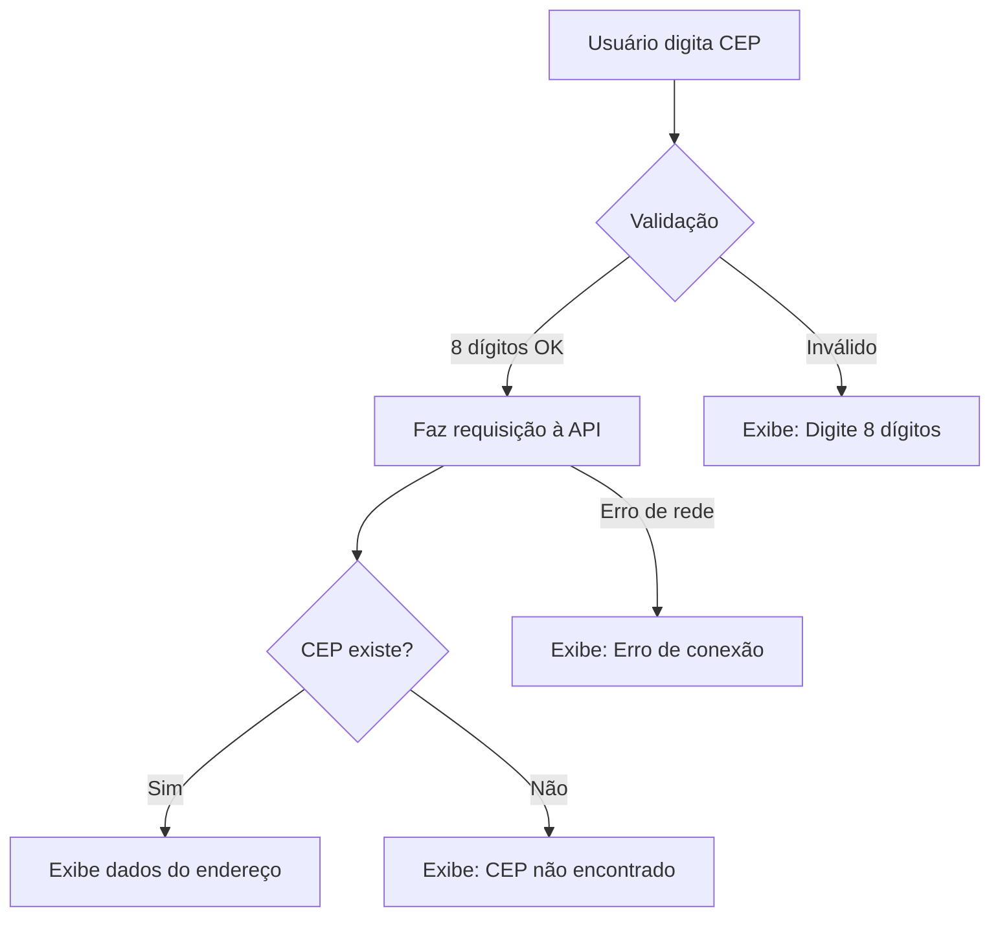

#  ViaCep - Consulta de CEP em Tempo Real

**Sistema inteligente de busca de endereços através do CEP, integrado à API ViaCEP**

---

## Sobre

**ViaCep** é uma aplicação web desenvolvida para facilitar a busca de informações de endereço através do CEP (Código de Endereçamento Postal). Com uma interface intuitiva e responsiva, o sistema valida automaticamente a entrada do usuário, consulta a API ViaCEP e retorna dados completos do endereço em tempo real.

### Objetivo

Proporcionar uma ferramenta rápida e eficiente para consulta de CEPs, eliminando a necessidade de preencher manualmente campos de endereço em formulários, economizando tempo e reduzindo erros de digitação.

---

## Tecnologias Utilizadas

### Recursos Técnicos

- **HTML5**: Estrutura semântica e acessível
- **CSS3**: Design moderno e responsivo
- **JavaScript ES6+**: Lógica de validação e consumo de API
- **Fetch API**: Requisições assíncronas para ViaCEP
- **Regex**: Validação de entrada numérica
- **API REST**: Integração com ViaCEP (viacep.com.br)

---

##  Funcionalidades

###  Validação Inteligente de Entrada
-  Aceita **apenas números** no campo de CEP
-  Validação de **8 dígitos** obrigatórios
-  Previne entrada de caracteres especiais e letras
-  Validação em tempo real

### Busca de CEP
-  **Requisição à API ViaCEP** em tempo real
-  Conexão assíncrona usando **Fetch API**
-  Resposta rápida e eficiente
-  Tratamento de erros de rede

### Exibição de Resultados

Quando o CEP é encontrado, o sistema exibe:

| Campo | Descrição |
|-------|-----------|
| **Logradouro** | Nome da rua/avenida |
| **Bairro** | Nome do bairro |
| **Cidade** | Município |
| **Estado** | Unidade Federativa (UF) |

### Tratamento de Erros

O sistema identifica e trata três tipos principais de erros:

1. **CEP Inválido** - Quando não possui 8 dígitos
2. **CEP Não Encontrado** - Quando não existe na base de dados
3. **Erro de Rede** - Problemas de conexão com a API

---

##  Demonstração

### Interface Principal

*Interface limpa e intuitiva para busca de CEP*

A interface conta com:
- Campo de entrada otimizado para CEP
- Botão de busca destacado
- Design minimalista e profissional
- Layout responsivo

---

### Busca Bem-Sucedida

*Exemplo de busca bem-sucedida com dados completos do endereço*

**Fluxo de Sucesso:**
1.  Usuário digita o CEP (8 dígitos)
2.  Clica no botão de busca
3.  Sistema faz requisição à API
4.  Dados do endereço são exibidos na tela

---

## Possíveis Erros e Validações

### Erro 1: CEP Não Encontrado

*Mensagem exibida quando o CEP não existe na base de dados*

**Causa:** CEP digitado não está cadastrado na base de dados dos Correios.

**Solução:** Verifique se o CEP está correto ou tente um CEP próximo.

---

### Erro 2: CEP Inválido (Formato)

*Validação quando o CEP não possui 8 dígitos*

**Causa:** CEP digitado possui menos ou mais de 8 dígitos.

**Solução:** Digite exatamente 8 números. Exemplo: `01310100`

---

##  Como Funciona

### Fluxograma de Funcionamento

## Casos de Uso

### E-commerce
Preenchimento automático de endereço em checkout

### Formulários
Cadastro de clientes com validação de endereço

###  Logística
Validação de endereços para entregas

### Sistemas Corporativos
Cadastro de filiais e fornecedores

---

##  Diferenciais

-  **Interface Intuitiva**: Design simples e fácil de usar
- **Rápido**: Busca em tempo real
- **Validação Robusta**: Múltiplas camadas de validação
-  **Responsivo**: Funciona em qualquer dispositivo
-  **Seguro**: Validação client-side antes de requisições
-  **Gratuito**: Usa API pública do ViaCEP

---

##  API Utilizada

### ViaCEP

**Endpoint:** `https://viacep.com.br/ws/{CEP}/json/`

**Exemplo de Resposta:**

 [Documentação Oficial da ViaCEP](https://viacep.com.br/)

---

## Licença

Este projeto está sob a licença MIT. Consulte o arquivo [LICENSE](LICENSE) para mais detalhes.

---

##  Contato

---

##  Aprendizados

Este projeto foi fundamental para desenvolver:

- **Consumo de APIs REST** com JavaScript
-  **Programação Assíncrona** com async/await
-  **Validação de dados** com Regex
-  **Design responsivo** com CSS3
-  **Tratamento de erros** em requisições HTTP
-  **UX/UI Design** focado no usuário

---

### ⭐ Se este projeto foi útil, considere dar uma estrela!

**Desenvolvido com 💙 por Nicolas Oliveira**

